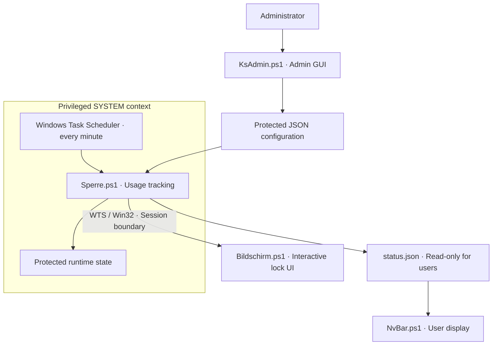

# Windows Screen Time Manager

A Windows screen-time management and parental-control system built with **PowerShell**, **Windows Task Scheduler/SYSTEM**, **WTS session handling**, **ACLs**, **Win32/.NET APIs**, **PBKDF2**, and **JSON configuration**.

System-wide time tracking runs in the background; status and lock interfaces appear in the active user session. Developed with assistance from Claude Code.

[Deutsch](README.md) · [Full documentation and screenshots](docs/DOCUMENTATION.en.md) · [Setup and usage guide](docs/GUIDE.en.md)


## Features

- Daily limits, grace periods, bonus time, and a configurable daily reset.
- Advance notices, a status display, and a full-screen lock interface.
- Recovery: breaks can return part of the used time.
- Administration window with automatic JSON configuration saving.
- Protected configuration, separate access permissions, and salted PBKDF2 PIN and tool-password hashes.

## Architecture



ACLs separate the protected system folder from the user-readable status display. See [architecture and security boundaries](docs/ARCHITECTURE.md).

## Getting started

Windows 10/11: download and extract the repository, open Windows PowerShell as administrator in its folder and run the [guided installer](docs/INSTALLER.md):

```powershell
powershell.exe -NoProfile -ExecutionPolicy Bypass -File .\Install.ps1
```

Choose an administrator account, time limits and PINs. Monitoring starts off; existing installations are never overwritten. **The complete Windows installer flow is not yet verified** – use a fresh test PC first. [Setup and uninstall](docs/INSTALLER.md) · [Manual setup](docs/GUIDE.en.md)

## Existing verification

The existing setup has been tested. The [full documentation](docs/DOCUMENTATION.en.md#what-is-verified-and-what-is-not) distinguishes verified functionality from open integration cases. Preview and test features: [guide](docs/GUIDE.en.md#4-testing-without-disturbing-anyone).

## Documentation

- [Workflow, settings, and all screenshots](docs/DOCUMENTATION.en.md)
- [Setup, usage, and troubleshooting](docs/GUIDE.en.md)
- [Architecture and security boundaries](docs/ARCHITECTURE.md)
- [Security](docs/DOCUMENTATION.en.md#security)

Error and repair screens are simulations, not actual hardware or operating-system failures. This project is not affiliated with Microsoft or NVIDIA.
