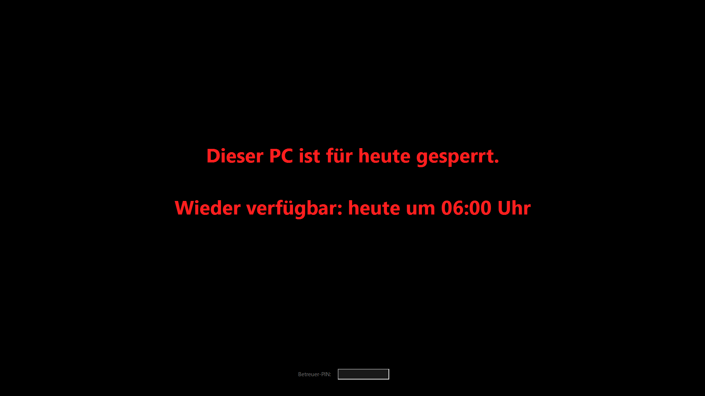
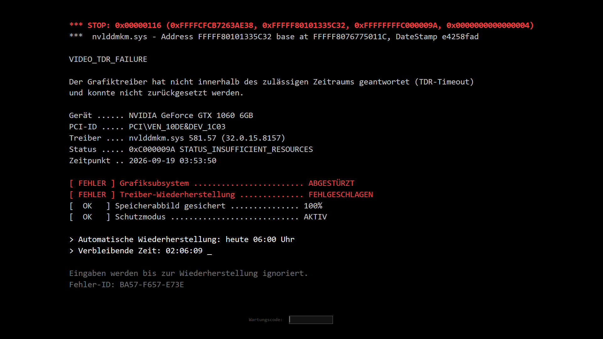
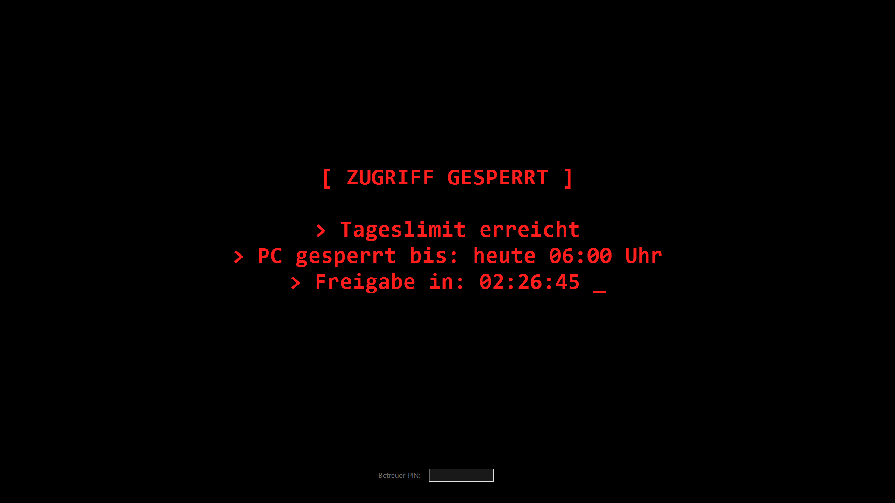

# Kindersperre (privates Backup)

Eigene Bildschirmzeit-Kindersicherung fuer den Familien-PC `cenks-pc`, gebaut mit Claude Code.
Dieses Repository ist **privat** und dient nur als Sicherung fuer den Besitzer/Administrator (Konto Verwalter).

**[English version: README.en.md](README.en.md)**

## Funktionsweise

- `Sperre.ps1` laeuft als geplante SYSTEM-Aufgabe jede Minute, zaehlt die Bildschirmzeit PC-weit
  (ausser fuer ausgenommene Benutzer) und startet bei erreichtem Tageslimit `Bildschirm.ps1`
  als Vollbild-Overlay in der jeweiligen Benutzersitzung (WTS-Sitzungstechnik).
- Vorwarnungen (Standard: 45/30/20/15/5/1 Min vor der Sperre) als Systemmeldungen.
- `Bildschirm.ps1` zeigt einen mehrstufigen, an einen echten Windows-Absturz angelehnten Ablauf
  (Bildfehler, Bluescreen, Logo, "Automatische Reparatur", periodischer Terminal-Bildschirm mit
  Wiederherstellungsversuchs-Zaehler auf einer Zeitachse bis zum taeglichen Reset).
- Tastensperre waehrend der Sperre (Win, Alt+Tab, Strg+Alt+Tab, Strg+Esc).
- Verstecktes PIN-Feld (Tastenkombination) fuer Bonuszeit; bei richtiger PIN zusaetzlich ein
  Grafikeffekt-Modus, der aus dem echten Bildschirminhalt Stoerungen erzeugt (mit Anfallsschutz:
  begrenzte Wechselrate, kaum Rot, begrenzte Flaeche mit starker Helligkeitsaenderung).
- `Zero.ps1` / `Zerooff.ps1` / `Zerotest.ps1`: Befehle zum sofortigen Ausloesen, Aufheben und
  Testen der Sperre (Testlaeufe ohne Beeinflussung des echten Zaehlers).
- `Claude-Start.ps1` / `Claude-Autostart-einrichten.ps1`: Autostart der steuernden Claude-Code-Sitzung
  beim Hochfahren des PCs.

## Screenshots

Aus Testlaeufen (Zerotest), nicht vom echten Betrieb.

*Einfache Sperr-Ansicht mit versteckbarem Betreuer-PIN-Feld unten rechts.*

*An einen echten Windows-Absturz angelehnte Bluescreen-Ansicht, mit echten Angaben zur verbauten Grafikkarte.*

*Fruehe Fassung der Terminal-Ansicht (spaeter durch einen Wiederherstellungsversuchs-Zaehler auf einer echten Zeitachse ersetzt).*

## Konfiguration

`config.json` enthaelt Tageslimits (Wochentag/Wochenende), Reset-Uhrzeit, Nachspielzeit, Bonuszeit,
ausgenommene Benutzer und optionale Schalter. Die `*.bak-vor-*`-Dateien sind Sicherungen fruehrerer
Versionen der Skripte, jeweils vor einer einzelnen Aenderung angelegt (Entwicklungsverlauf).

## Absichtlich NICHT in diesem Repository (siehe .gitignore)

- `pin.json` / `Set-PIN.ps1` (PIN-Hash bzw. das Skript, das ihn setzt)
- Echte Nutzungsdaten: `zeit.json`, Protokolle, Verlaufsdateien, tagesaktuelle Registry-Sicherungen

## Kontext

Eigener PC, eigenes Administrator-Konto, Kindersicherung fuer die eigenen Kinder. Kein Netzwerkzugriff,
keine Tastatureingaben-Aufzeichnung, keine dauerhafte Bildspeicherung ausser in Testlaeufen. Details und
Entwicklungsverlauf: siehe Kommentare in den Skripten selbst.