# Kindersperre (privates Backup)

Eigene Bildschirmzeit-Kindersicherung für den Familien-PC `cenks-pc`, gebaut mit Claude Code.
Dieses Repository ist **privat** und dient als Sicherung und Dokumentation für den Besitzer/Administrator (Konto Verwalter).

**[English version: README.en.md](README.en.md)** · **[Anleitung: Einrichten, Einstellen, Aktivieren](docs/ANLEITUNG.md)** · **[Guide in English](docs/GUIDE.en.md)**

## Inhalt

1. [Ausgangslage](#ausgangslage)
2. [Ablauf, wenn der Tagesgrenzwert erreicht ist (mit Bildern)](#ablauf-wenn-der-tagesgrenzwert-erreicht-ist)
3. [Grafikfehler-Modus nach dem Zusatz-Code (mit Bildern)](#grafikfehler-modus-nach-dem-zusatz-code)
4. [Einstellungs-Fenster „NVIDIA Systemdiagnose" (mit Bildern)](#einstellungs-fenster-nvidia-systemdiagnose)
5. [NVIDIA-Anzeige (mit Bildern)](#nvidia-anzeige)
6. [Erholung](#erholung)
7. [Geheimtasten und Befehle](#geheimtasten-und-befehle)
8. [Alle Einstellungen (`config.json`)](#alle-einstellungen-configjson)
9. [Dateien in diesem Repository](#dateien-in-diesem-repository)
10. [Sicherheit](#sicherheit)
11. [Nicht in diesem Repository](#nicht-in-diesem-repository)
12. [Was geprüft ist und was nicht](#was-geprüft-ist-und-was-nicht)

## Ausgangslage

Konten: **Verwalter** (einziger Administrator, zählt nicht, nie gesperrt), **Öztunc** (Konto, auf dem gespielt und auch vom
Erwachsenen selbst gearbeitet wird) und **Schwester** (Kinderkonto). Die Sperre zählt die Bildschirmzeit aller Konten außer
Verwalter zusammen (`zeit.json`, PC-weit) und begrenzt sie pro Tag (Mo–Fr 360 Min, Sa/So 480 Min, dazu 15 Min Nachspielzeit).

`Sperre.ps1` läuft als geplante **SYSTEM-Aufgabe jede Minute** (auch beim Start und bei jeder Anmeldung), zählt, warnt und
startet bei erreichtem Grenzwert `Bildschirm.ps1` als Vollbild in der jeweiligen Benutzersitzung (WTS-Sitzungstechnik, ohne
dass sich jemand extra anmelden müsste). Tageswechsel ist 6 Uhr.

## Ablauf, wenn der Tagesgrenzwert erreicht ist

Die Bilder in diesem Abschnitt stammen aus Testläufen. Sie zeigen nur die selbst gemalten Fehlerbildschirme, keinen echten
Bildschirminhalt.

| Schritt | Was passiert |
|---|---|
| 1. Vorab-Meldungen | Systemmeldungen, getarnt als „NVIDIA Grafiktreiber"-Warnung. Standard: 15 und 1 Minute vorher (wählbar aus 45/30/20/15/5/1). Dazu öffnet sich die [NVIDIA-Anzeige](#nvidia-anzeige). |
| 2. Bildfehler | Bildfehler auf dem echten Desktop, kurzes Schwarzbild, starker Bildfehler. |
| 3. Bluescreen | Windows-10-Bluescreen `VIDEO_TDR_FAILURE` (Treiber `nvlddmkm.sys`, echter Name der verbauten Grafikkarte, QR-Code). |
| 4. Logo und Reparatur | Windows-Logo mit Ladepunkten, dann „Automatische Reparatur wird vorbereitet" und „Diagnose des PCs wird ausgeführt", unten links eine kleine graue Datei-/Programmzeile. Beide Sätze sind einstellbar. |
| 5. Terminal | Alle 8 bis 14 Minuten (zufällig) für 2 Minuten ein Terminal-Fehlerbildschirm „Wiederherstellungsversuch N von 30" (ohne Uhrzeit und Countdown). Die 30 Versuche sind über die echte Sperrdauer bis 6 Uhr verteilt. |
| 6. Ende | Zum Tageswechsel: 2 s Schwarz, 6 s Logo, dann der Desktop. |

Während der Sperre sind Windows-Taste, Alt+Tab, Strg+Alt+Tab, Strg+Esc und Strg+Umschalt+Esc gesperrt. Strg+Alt+Entf
kann Windows selbst nicht sperren.

### Bluescreen
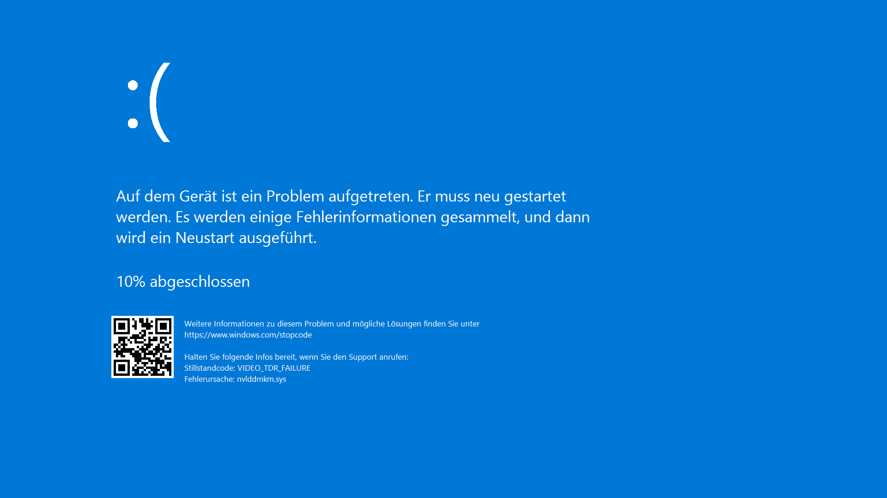

Nachbau des Windows-10-Bluescreens. Stoppcode `VIDEO_TDR_FAILURE`, Treiber `nvlddmkm.sys`, Texte aus den Windows-Dateien dieses PCs.

### Windows-Logo

Das Windows-Logo mit den laufenden Ladepunkten. Es erscheint nach dem Bluescreen und auch am Ende der Sperre.

### Reparatur / Diagnose
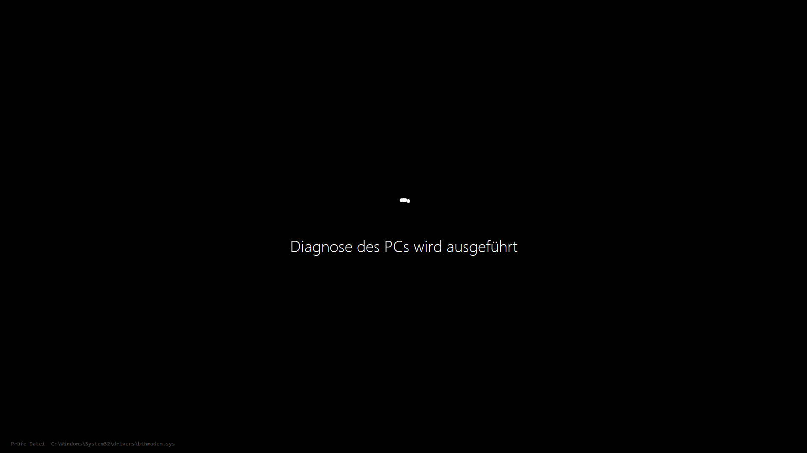

Weißer Text auf Schwarz unter den Ladepunkten (hier: „Diagnose des PCs wird ausgeführt"), unten links die kleine Zeile mit der
gerade „geprüften" Datei. Der Text ist im Einstellungs-Fenster (Reiter „Diagnose") änderbar.

### Terminal

Der Terminal-Fehlerbildschirm: STOP-Zeile, Gerät, Treiber, Status und die Liste der Wiederherstellungsversuche. Jeder Versuch
endet mit `FEHLGESCHLAGEN (0xC000009A)`, der laufende hat einen Balken. Schrift, Größe, Abstand und Dauer sind einstellbar.

## Grafikfehler-Modus nach dem Zusatz-Code

Wer während der Sperre den richtigen Code (PIN) eingibt, bekommt **+60 Minuten** und danach bis 6 Uhr den Grafikfehler-Modus
(einstellbar: `PinGlitch`, `GlitchLevel`). Ein durchsichtiges, klick-durchlässiges Fenster verzerrt den **echten Bildschirminhalt**:
Zerreißen, Klotzbildung, abrutschende Bildteile, senkrechtes Durchrollen, Kachelmüll, Zeilenausfälle, vertauschte Farben und
Farblinien. Feste Schäden wachsen alle 2 Minuten seit der letzten Bonus-Eingabe bis Stufe 12. Die Stärke gleitet (0 bis 100):
nach dem Code baut sich der Effekt in ca. 40 s auf, mit F1+F12 klingt er in ca. 10 s aus und kommt in ca. 11 s stotternd zurück.

**Anfallsschutz, nicht lockern:** höchstens ca. 1,4 Wechsel pro Sekunde, kaum reines Rot, Fläche mit starker Helligkeitsänderung
unter 25 % (gemessen max. 22,9 %).

Das Fenster ist per `SetWindowDisplayAffinity` aus Bildschirmaufnahmen ausgeschlossen, normale Screenshots zeigen den Effekt
daher nicht. Echte Aufnahmen enthielten außerdem immer den echten Bildschirminhalt und gehören deshalb nicht ins Repository.

**Die folgenden Bilder sind trotzdem Beispiele der echten Effekt-Funktion** (`KsFx.LiveArtifacts3` aus `Bildschirm.ps1`,
Skript `tools/render-glitch.ps1`), angewendet auf einen **selbst gemalten Beispiel-Desktop** mit erfundenem Text. Es wurde kein
echter Bildschirm aufgenommen.

### Ausgangsbild (ohne Effekt)
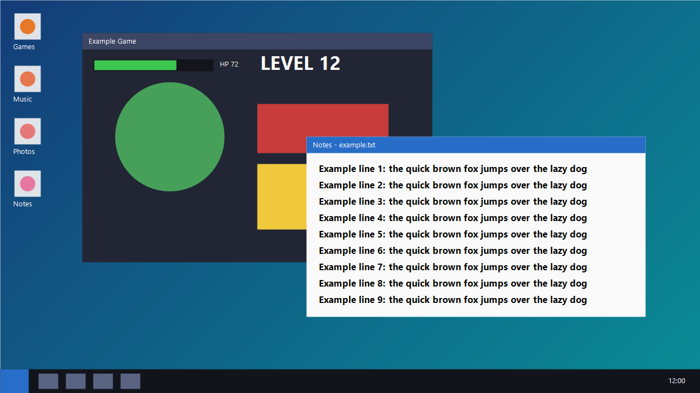

Der gemalte Beispiel-Desktop: Symbole, ein „Spiel"-Fenster, ein Textfenster, Taskleiste.

### Anfang (Stärke 30)
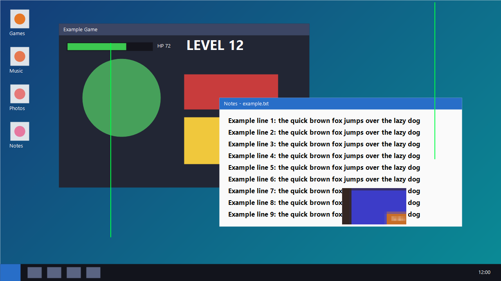

Kurz nach dem Code: nur wenige dünne Farblinien und ein kleiner Klotzfehler. Bei schwachem Effekt gibt es auch Aussetzer, dann
sieht man nur die festen Reste.

### Mittel (Stärke 65)
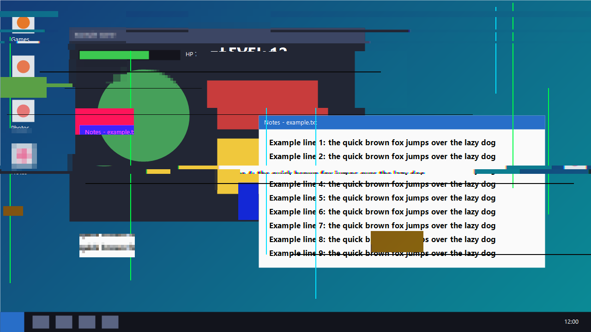

Mehr Klotzbildung, verschobene Streifen und Zeilenausfälle. Große abrutschende Bildteile gibt es erst ab Stärke 50.

### Voll (Stärke 100)
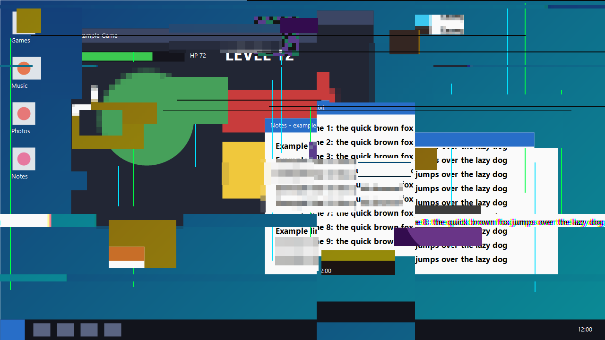

Voller Effekt: zerrissene Bänder, Kachelmüll, vertauschte Bereiche, Farblinien, schwarze Zeilen.

### Später Zustand (Stärke 100, Stufe 12)
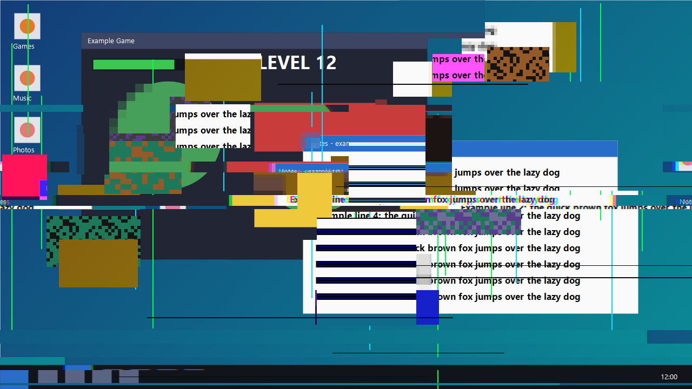

Zwei Stunden nach der letzten Bonus-Eingabe: die festen Schäden haben ihr Maximum erreicht.

## Einstellungs-Fenster „NVIDIA Systemdiagnose"

`KsAdmin.ps1` ist ein Fenster, in dem sich **alles einstellen lässt**, ohne Dateien zu bearbeiten. Es liegt im geschützten
Ordner `C:\ProgramData\Kindersperre` (nur SYSTEM und Administratoren), eine Verknüpfung liegt nur auf dem Desktop von Verwalter.
Kinder-Konten können es deshalb weder sehen noch öffnen (geprüft: `Test-Path` liefert für Öztunc `False`).

- **Neutrales Aussehen:** Titel „NVIDIA Systemdiagnose", Desktop-Symbol „Systemdiagnose", und kein sichtbarer Text enthält Wörter
  wie „Kind", „Sperre" oder „Limit" (ein Test prüft das). So lässt es sich benutzen, wenn jemand danebensitzt. Nicht neutral
  bleiben Dateinamen und Pfade (z. B. in den Eigenschaften der Verknüpfung).
- **Speichert sofort automatisch**, kurz nach jeder Änderung, kein Speichern-Knopf. Vor der ersten Änderung je Sitzung entsteht
  eine Sicherung von `config.json` (die letzten 20 bleiben). Änderungen wirken auch bei einer schon laufenden Anzeige (nach
  höchstens 5 s).
- **Größe anpassbar:** an den Rändern ziehen, die Reiter scrollen bei kleinem Fenster. Die Schriftgröße (9–12) wählt man im Reiter
  „Hilfe". Beides wird in `tool-ui.json` gemerkt.
- **Untere Leiste:** glatter Balken mit der Auslastung von heute in Prozent und der Restzeit (aus `status.json`, alle 5 s).
- **Passwörter:** Reiter „Zugriff" ändert das Werkzeug-Passwort dieses Fensters (PBKDF2-Hash in `tool-pin.json`, nicht im
  Repository) und das **Windows-Anmeldepasswort von Verwalter**. Das Windows-Passwort wird mit dem aktuellen Passwort *geändert*
  (nicht zurückgesetzt), damit gespeicherte Anmeldedaten und verschlüsselte Daten erhalten bleiben. Kein Passwort wird
  gespeichert, protokolliert oder auf einer Kommandozeile übergeben. Geprüft gegen ein Wegwerf-Konto mit echter Windows-Anmeldung.

### Reiter „Grenzwerte"
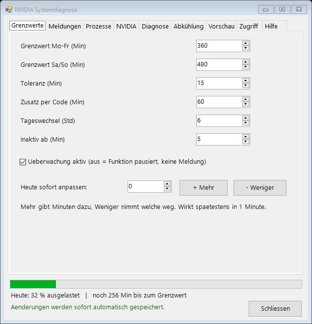

Grenzwerte Mo–Fr und Sa/So, Nachspielzeit, Zusatz-Minuten per Code, Tageswechsel-Stunde, Inaktiv-Grenze, Schalter
**Überwachung an/aus**, und „heute sofort mehr/weniger" (schreibt `adjust.txt`, wirkt beim nächsten Lauf, höchstens 1 Minute).

### Reiter „Meldungen"
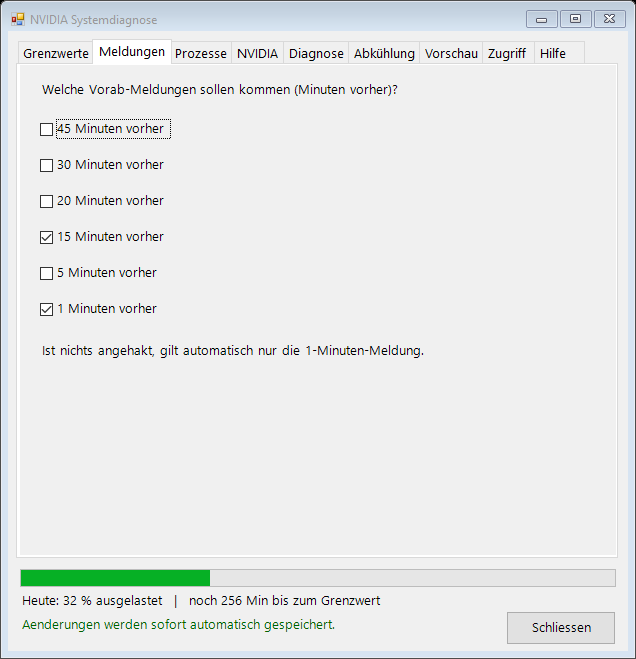

Welche Vorab-Meldungen kommen (45/30/20/15/5/1 Minuten vorher). Standard: 15 und 1.

### Reiter „Prozesse"
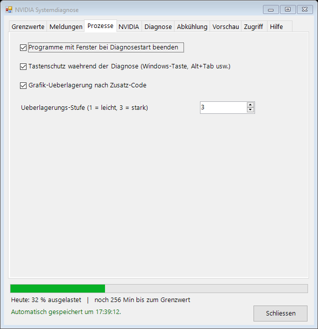

Programme beenden, Tastenschutz, Grafikfehler-Modus nach dem Code und dessen Stufe.

### Reiter „NVIDIA"
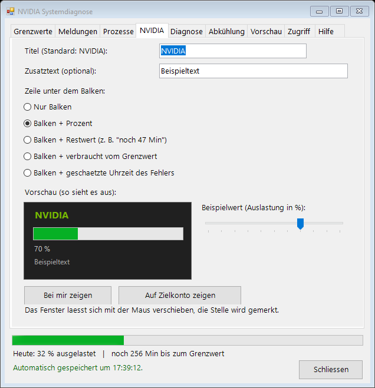

Titel, Zusatztext, Zeile unter dem Balken (Standard: „Balken + Prozent"), **Vorschau** mit Beispielwert-Regler und Test-Knöpfe.

### Reiter „Diagnose"
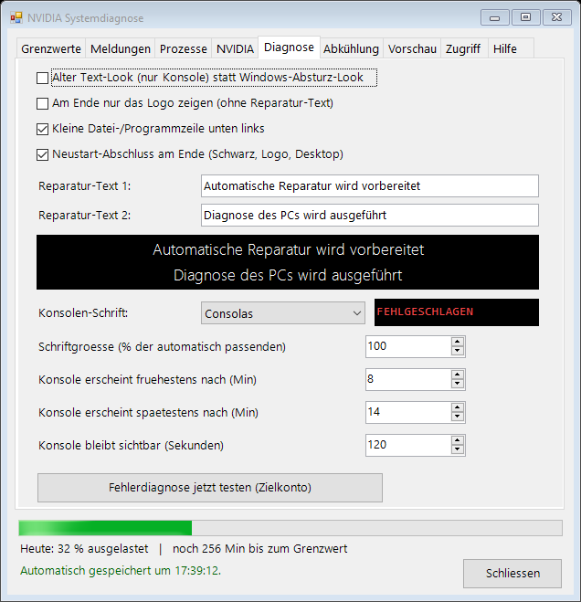

Aussehen, Endphase, Dateizeile, Neustart-Abschluss, **Reparatur-Sätze**, **Konsolen-Schrift, -Größe, -Abstand und -Dauer** mit
Vorschau.

### Reiter „Abkühlung" (Erholung)
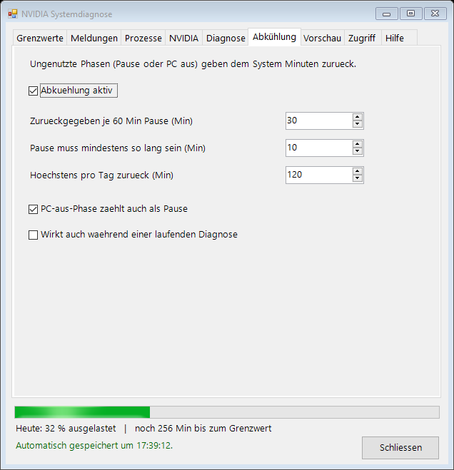

Siehe [Erholung](#erholung). **Standardmäßig an.**

### Reiter „Vorschau"
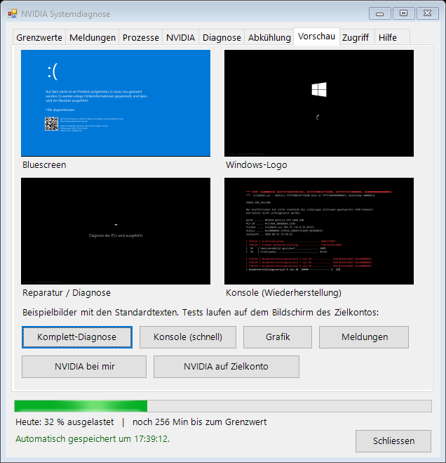

Die vier Beispielbilder der Fehlerbildschirme und die **Test-Knöpfe** (Komplett-Diagnose, Konsole schnell, Grafik, Meldungen,
NVIDIA-Anzeige bei mir / auf dem Zielkonto). Knöpfe, die auf dem Bildschirm des Zielkontos laufen, fragen vorher nach.

### Reiter „Zugriff"
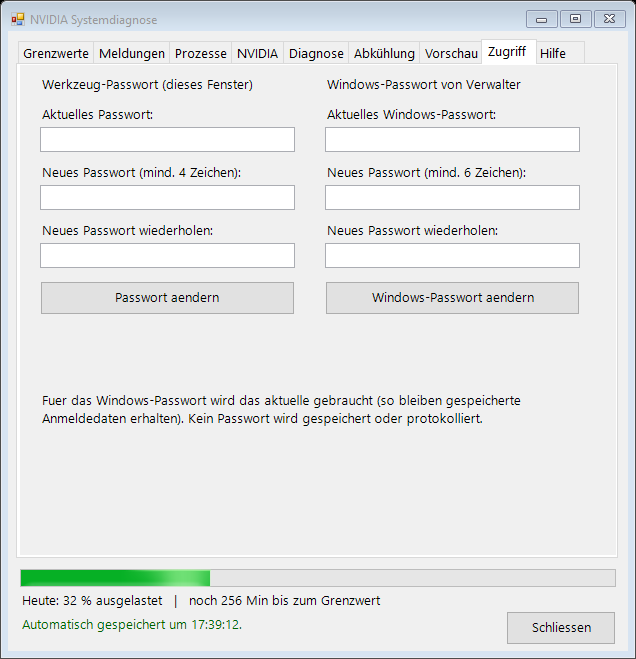

Links das Werkzeug-Passwort, rechts das Windows-Passwort von Verwalter.

### Reiter „Hilfe" mit Info-Knopf
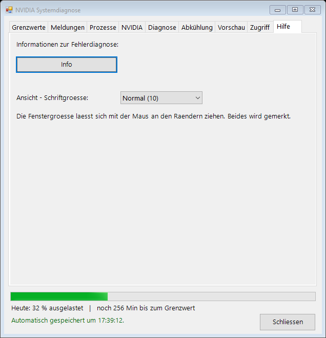

Der Reiter zeigt nur einen Knopf „Info" und die Schriftgröße, damit niemand am Bildschirm gleich alles lesen kann.

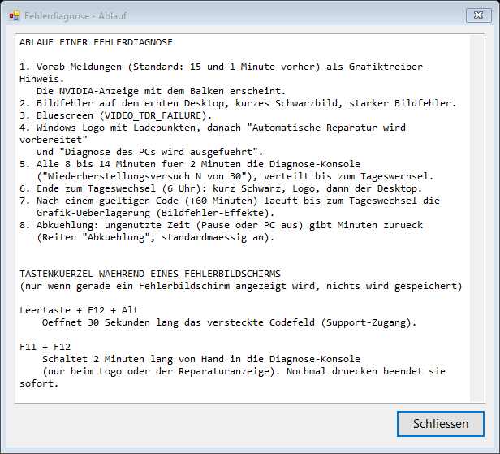

„Info" öffnet das Fenster **„Fehlerdiagnose – Ablauf"** mit dem ganzen Ablauf, den Tastenkürzeln, Befehlen und Test-Knöpfen. Es
kommt ohne Wörter wie Kind oder Sperre aus.

### Kleines und großes Fenster
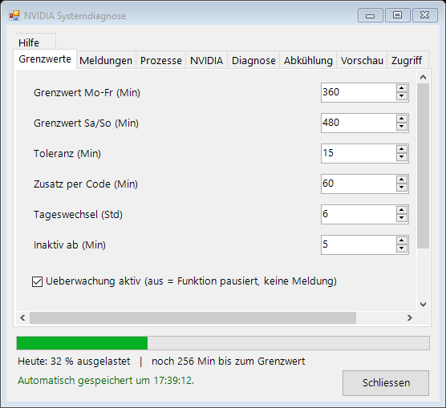
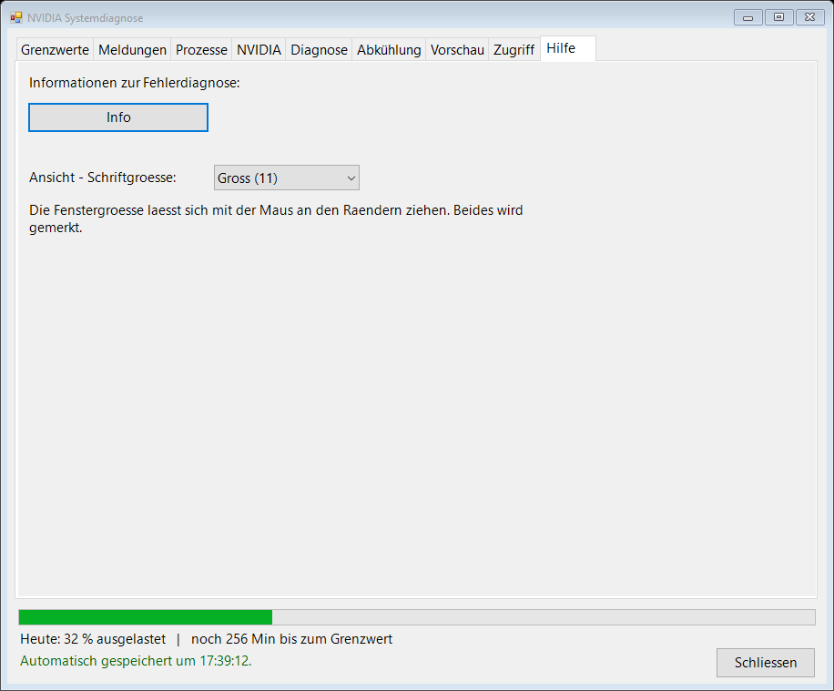

Das Fenster lässt sich an den Rändern beliebig verkleinern und vergrößern.

## NVIDIA-Anzeige

Ein kleines, freiwilliges Fenster (`NvContainer/NvBar.ps1`): Titel (Standard „NVIDIA"), ein glatter Balken, darunter eine Zeile
(**Standard: Prozent**; wählbar: nur Balken, Restzeit, verbraucht/Grenzwert, geschätzte Uhrzeit) und ein frei wählbarer
Zusatztext. Es öffnet sich automatisch bei der frühesten eingestellten Vorab-Meldung, per Desktop-Verknüpfung oder mit „Bei mir
zeigen" im Einstellungs-Fenster. Immer im Vordergrund.

- **Verschiebbar:** an jeder Stelle mit der Maus ziehen, die Stelle wird je Benutzer gemerkt (`%LOCALAPPDATA%\NvBarPos.txt`).
- **Größe:** an allen Rändern (unten, rechts, links, oben) ziehbar, wird gemerkt (`NvBarSize.txt`). Ohne eigene Größe passt sich
  die Höhe dem Inhalt an: **ohne Zusatztext ist das Fenster schlank** (etwa 70 statt 132 Pixel), mit Text wird es höher. Zieht
  man es höher, wird der Balken dicker.
- `Sperre.ps1` schreibt jede Minute nur Zahlen und den Text in `status.json` in einen öffentlich **lesbaren** Ordner
  (`C:\ProgramData\NVIDIA Corporation\NvContainer`, Benutzer nur lesen/ausführen), damit Standardbenutzer das Fenster ohne Zugriff
  auf den geschützten Ordner nutzen können. Bei echtem Vollbild mancher Spiele ist ein solches Fenster wie jedes Overlay unter
  Umständen nicht sichtbar (Windows-Grenze).

### Standard: Balken + Prozent, ohne Text
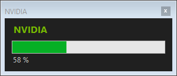

### Nur Balken
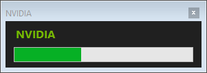

### Mit Zusatztext
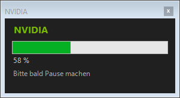

### Verkleinert und vergrößert
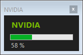
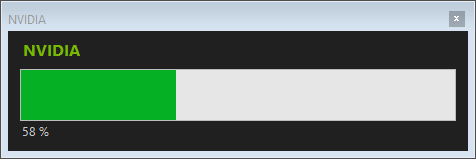

## Erholung

Ungenutzte Zeit (Leerlauf bei laufendem PC oder PC aus) gibt Minuten vom Tagesgrenzwert zurück. **Standardmäßig an**
(ausgeschaltet nur bei `RegenEnabled: false` bzw. ohne Haken im Reiter „Abkühlung"). Alles einstellbar:

- zurückgegeben je 60 Minuten Pause: Standard 30
- Pause mindestens: Standard 10 Minuten
- höchstens pro Tag: Standard 120 Minuten (der Zähler geht nie unter 0)
- PC-aus-Zeit zählt als Pause: Standard ja
- wirkt auch während einer laufenden Sperre: Standard nein

## Geheimtasten und Befehle

Nur in der laufenden Sperre, nichts wird gespeichert:

| Kombination | Wirkung |
|---|---|
| Leertaste + F12 + Alt | zeigt 30 s lang ein verstecktes Code-Feld |
| F11 + F12 | Terminal von Hand für 2 Minuten (nochmal drücken beendet sofort; nur bei Logo/Reparatur) |
| F1 + F12 | Grafikfehler-Effekte aus/an (erst F12 halten, dann F1) |
| Z + F12 | zeigt ca. 6 s die geschätzte Restzeit bis zum Ende der Sperre |

Befehle, indem man dem steuernden Claude-Code-Chat genau dieses eine Wort schreibt (die Test-Knöpfe im Fenster tun dasselbe):

| Befehl | Wirkung |
|---|---|
| `Zerotest` | kompletter Testlauf, ca. 2,5 Min, ohne den echten Zähler zu ändern |
| `Zerofull` | wie Zerotest, vorher alle Vorab-Meldungen |
| `Zeroterm` | Zeitraffer der Terminal-Auftritte |
| `Zeroglitch` | 60 s Vorschau des Grafikfehler-Modus |
| `Zero` / `Zerooff` | Sperre sofort auslösen / aufheben |
| `Zerokill` | wie `Zero`, beendet zusätzlich alle Programme mit Fenster in der Kinder-Sitzung |

## Alle Einstellungen (`config.json`)

Reines ASCII (Sonderzeichen als `\uXXXX`). Fehlende Einträge nehmen den Standard. Das Fenster schreibt sie.

| Schlüssel | Bedeutung (Standard) |
|---|---|
| `WeekdayLimitMin`, `WeekendLimitMin` | Tagesgrenzwert in Minuten (360 / 480) |
| `GraceMin` | Nachspielzeit (15) |
| `BonusMin` | Bonus per Code (60) |
| `ResetHour` | Tageswechsel-Stunde (6) |
| `IdleMin` | Leerlauf, ab dem Minuten nicht mehr zählen (5) |
| `Enabled` | `false` = kein Grenzwert, keine Warnung, keine Sperre |
| `FreeDays`, `ExcludeUsers` | freie Wochentage / nicht gezählte Benutzer |
| `WarnMinutes` | Vorab-Meldungen, z. B. `[15,1]` |
| `KillApps`, `KillPauseUntil` | Programme beenden / Pause dafür bis zu einem Datum |
| `KeyLock`, `PinGlitch`, `GlitchLevel` | Tastensperre, Grafikfehler nach dem Code, Stufe 1–3 |
| `Look`, `EndPhase`, `FileTicker`, `Outro` | Aussehen der Sperre |
| `RepairText1`, `RepairText2` | Reparatur-Sätze (leer = Standard) |
| `TermFont`, `TermFontScale` | Terminal-Schrift und Größe in % der automatischen Größe (50–100) |
| `TermMinGapSec`, `TermMaxGapSec`, `TermDurSec` | Terminal-Abstand (480–840 s) und Dauer (120 s) |
| `NvBarMode`, `NvBarTitle`, `NvBarNote` | NVIDIA-Anzeige: Modus (`bar`, `pct`, `rest`, `used`, `clock`), Titel, Zusatztext |
| `RegenEnabled`, `RegenPerHourMin`, `RegenMinPauseMin`, `RegenMaxPerDayMin`, `RegenCountOff`, `RegenWhileLocked` | Erholung |

Die Dateien `*.bak-vor-*` sind Sicherungen früherer Fassungen, je direkt vor einer einzelnen Änderung angelegt (Entwicklungsverlauf).

## Dateien in diesem Repository

| Datei | Zweck |
|---|---|
| `Sperre.ps1` | zählt, warnt, startet die Sperre (SYSTEM-Aufgabe, jede Minute). UTF-8 **mit BOM**, LF |
| `Bildschirm.ps1` | der Sperrbildschirm mit allen Effekten. UTF-8 **mit BOM**, LF |
| `KsAdmin.ps1` | das Einstellungs-Fenster „NVIDIA Systemdiagnose" |
| `NvContainer/NvBar.ps1` | die NVIDIA-Anzeige |
| `Zero.ps1`, `Zerooff.ps1`, `Zerotest.ps1` | Befehle (sofort sperren, aufheben, Testlauf) |
| `Claude-Start.ps1`, `Claude-Autostart-einrichten.ps1` | Autostart der Claude-Sitzung (Remote Control in Sitzung 0 nicht bewiesen) |
| `IdleProbe.cs`, `IdleProbe.exe` | misst die Leerlaufzeit |
| `config.json` | die Einstellungen |
| `assets/winlogo.png` | das Windows-Logo für den Sperrbildschirm |
| `docs/` | Bilder und die Anleitungen |
| `tools/render-glitch.ps1` | erzeugt die Grafikfehler-Beispielbilder auf einem gemalten Desktop |

## Sicherheit

- Der Ordner `C:\ProgramData\Kindersperre` ist nur für SYSTEM und Administratoren zugänglich.
- Der öffentliche NVIDIA-Ordner erlaubt Standardbenutzern **nur Lesen und Ausführen**, kein Schreiben (sonst könnte ein Kind die
  Datei ersetzen). Die NVIDIA-Anzeige wird als **angemeldeter Benutzer** gestartet, nicht als SYSTEM.
- Das Werkzeug-Passwort schützt das Fenster, **nicht** gegen jemanden, der das Windows-Passwort von Verwalter kennt (der kann die
  Dateien direkt ändern). Das Windows-Passwort von Verwalter darf deshalb nicht weitergegeben werden.
- `pin.json`, `Set-PIN.ps1` und `tool-pin.json` werden nie ausgegeben (feste Regel).
- Der Anfallsschutz beim Grafikfehler-Effekt und der Schutz des Sperr-Ordners werden nicht gelockert.

## Nicht in diesem Repository

- `pin.json`, `Set-PIN.ps1`, `tool-pin.json` (PIN- und Passwort-Hashes)
- echte Nutzungsdaten (`zeit.json`, Protokolle, Verlauf) und tagesbezogene Registry-Sicherungen
- echte Bildschirmaufnahmen des Grafikfehler-Modus (sie zeigen immer echten Bildschirminhalt); die Grafikfehler-Bilder oben sind
  Beispiele auf einem gemalten Desktop

## Was geprüft ist und was nicht

| Geprüft | Nicht geprüft |
|---|---|
| Alle Test-Suiten (Rechenlogik der Erholung, Passwort-Hash, Fenster, Anzeige-Größe, neutrale Texte, Windows-Passwort mit Wegwerf-Konto) | Echte Mausklicks auf den Test-Knöpfen auf dem Bildschirm des Kindes |
| Skripte ohne Syntaxfehler, Aufgabe läuft mit Ergebnis 0 | NVIDIA-Anzeige bei Spielen im echten Vollbild |
| Bilder aus den echten Fenstern gezeichnet (ohne Anzeige) | Der echte mehrstündige Ablauf mit echtem 6-Uhr-Ende (nur im Zeitraffer) |
| Grafikfehler-Bilder mit der echten Effekt-Funktion | Reparatur-Sätze im Vergleich mit einem echten Windows-PC |
