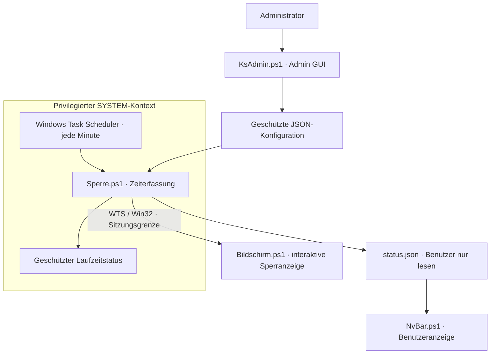

# Windows Screen Time Manager

Ein Windows-System zur Bildschirmzeitverwaltung und Kindersicherung mit **PowerShell**, **Windows Task Scheduler/SYSTEM**, **WTS Session Handling**, **ACLs**, **Win32/.NET APIs**, **PBKDF2** und **JSON-Konfiguration**.

Systemweite Zeiterfassung läuft im Hintergrund; Status- und Sperroberflächen erscheinen in der aktiven Benutzersitzung. Entwickelt mit Unterstützung von Claude Code.

[English](README.en.md) · [Vollständige Dokumentation und Screenshots](docs/DOCUMENTATION.md) · [Einrichtung und Bedienung](docs/ANLEITUNG.md)

## Funktionen

- Tageslimits, Nachspielzeit, Bonuszeit und konfigurierbarer Tageswechsel.
- Vorab-Meldungen, Statusanzeige und Vollbild-Sperranzeige.
- Erholung: Pausen können verbrauchte Zeit teilweise zurückgeben.
- Administrationsfenster mit automatischer Speicherung der JSON-Konfiguration.
- Geschützte Konfiguration, getrennte Zugriffsrechte und gesalzene PBKDF2-Hashes für PIN und Werkzeug-Passwort.

## Architektur

ACLs trennen den geschützten Systemordner von der für Benutzer lesbaren Statusanzeige. Details: [Architektur und Sicherheitsgrenzen](docs/ARCHITECTURE.md).

## Einstieg

Windows 10/11 mit Windows PowerShell 5.1 und Administratorrechten. Die [Einrichtungsanleitung](docs/ANLEITUNG.md#5-neu-einrichten-aufbau-der-vorhandenen-installation) beschreibt die bestehende Installation einschließlich Dateien, ACLs und SYSTEM-Aufgabe.

Die Einrichtung auf einem frischen PC ist nicht als vollständiger Installationsablauf verifiziert. Einige Skripte setzen den Kontonamen `Verwalter` voraus; `ExcludeUsers` allein reicht zur Anpassung nicht aus. PIN-Dateien und das lokale Werkzeug `Set-PIN.ps1` werden nicht veröffentlicht. Zuerst mit einem Testkonto prüfen.

## Bisherige Prüfung

Das bestehende Setup wurde getestet. Die [vollständige Dokumentation](docs/DOCUMENTATION.md#was-geprüft-ist-und-was-nicht) unterscheidet geprüfte Funktionen und offene Integrationsfälle. Vorschau- und Testfunktionen: [Anleitung](docs/ANLEITUNG.md#4-test-ohne-jemanden-zu-stören).

## Dokumentation

- [Abläufe, Einstellungen und alle Screenshots](docs/DOCUMENTATION.md)
- [Einrichtung, Bedienung und Fehlerbehebung](docs/ANLEITUNG.md)
- [Architektur und Sicherheitsgrenzen](docs/ARCHITECTURE.md)
- [Security](docs/DOCUMENTATION.md#sicherheit)

Die Fehler- und Reparaturbildschirme sind Simulationen, keine echten Hardware- oder Betriebssystemfehler. Das Projekt ist nicht mit Microsoft oder NVIDIA verbunden.
