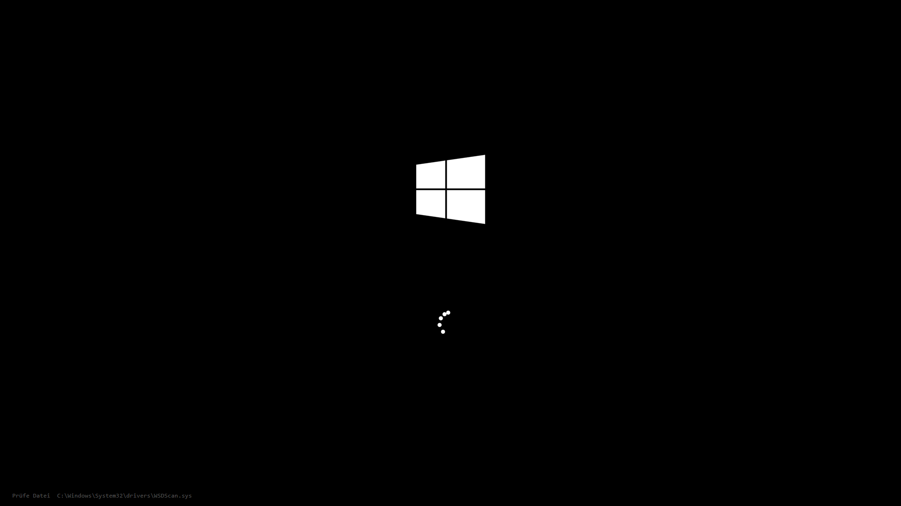
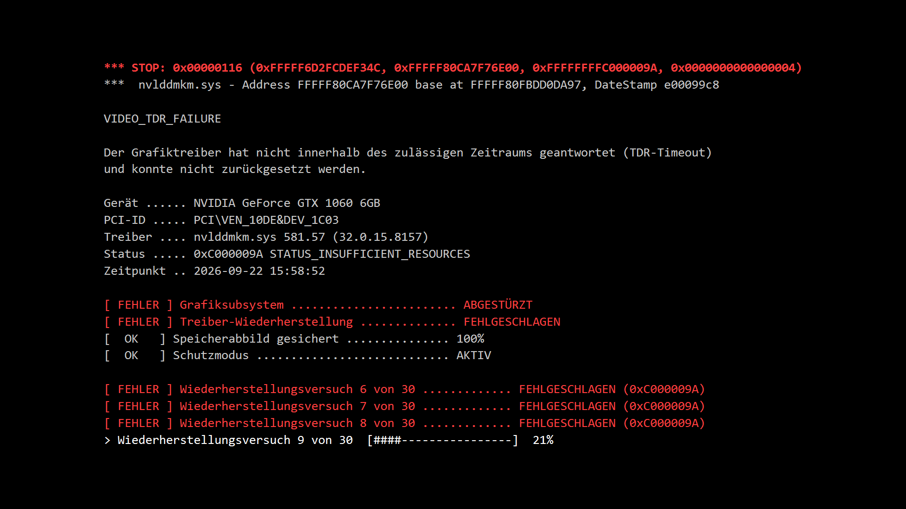

# Full documentation

[Overview](../README.en.md) · [Deutsche Dokumentation](DOCUMENTATION.md) · [Setup guide](GUIDE.en.md)

## Contents

1. [Background](#background)
2. [What happens when the daily threshold is reached (with pictures)](#what-happens-when-the-daily-threshold-is-reached)
3. [Glitch mode after the bonus code (with pictures)](#glitch-mode-after-the-bonus-code)
4. [Settings window "NVIDIA Systemdiagnose" (with pictures)](#settings-window-nvidia-systemdiagnose)
5. [NVIDIA display (with pictures)](#nvidia-display)
6. [Recovery](#recovery)
7. [Hidden keys and commands](#hidden-keys-and-commands)
8. [All settings (`config.json`)](#all-settings-configjson)
9. [Files in this repository](#files-in-this-repository)
10. [Security](#security)
11. [Not in this repository](#not-in-this-repository)
12. [What is verified and what is not](#what-is-verified-and-what-is-not)

## Background

The documented setup uses an excluded **administrator account** and monitored **standard-user accounts**. Screen time is added up across monitored accounts (`zeit.json`, PC-wide): Mon–Fri 360 minutes, Sat/Sun 480 minutes, plus 15 minutes of grace. Account names in this documentation are generic.

**Compatibility note:** The unchanged scripts contain the fixed account name `Verwalter` in several places, particularly Windows password changes and session tests. Changing `ExcludeUsers` alone does not adapt those paths. The guide describes the existing installation; using other account names requires a separate review.

`Sperre.ps1` runs as a scheduled **SYSTEM task every minute** (also at boot and at every logon), counts, warns and, when the
threshold is reached, launches `Bildschirm.ps1` as a full-screen overlay in the relevant user session (WTS session technique,
nobody has to log in separately). The day changes at 6 am.

## What happens when the daily threshold is reached

The pictures in this section come from test runs. They show only the self-drawn error screens, no real screen content.

| Step | What happens |
|---|---|
| 1. Advance notices | System messages disguised as an "NVIDIA graphics driver" warning. Default: 15 and 1 minute before (selectable from 45/30/20/15/5/1). The [NVIDIA display](#nvidia-display) opens too. |
| 2. Glitches | Screen glitches on the real desktop, a short black screen, a strong glitch. |
| 3. Bluescreen | Windows 10 bluescreen `VIDEO_TDR_FAILURE` (driver `nvlddmkm.sys`, real name of the installed graphics card, QR code). |
| 4. Logo and repair | Windows logo with loading dots, then "Preparing automatic repair" and "Running PC diagnostics", with a small grey file line at the bottom left. Both sentences are editable. |
| 5. Terminal | Every 8 to 14 minutes (random) for 2 minutes a terminal error screen "Recovery attempt N of 30" (no clock, no countdown). The 30 attempts are spread over the real lock duration until 6 am. |
| 6. End | At the day change: 2 s black, 6 s logo, then the desktop. |

During the lock the Windows key, Alt+Tab, Ctrl+Alt+Tab, Ctrl+Esc and Ctrl+Shift+Esc are blocked. Windows itself cannot block
Ctrl+Alt+Del.

### Bluescreen

Replica of the Windows 10 bluescreen. Stop code `VIDEO_TDR_FAILURE`, driver `nvlddmkm.sys`, texts taken from this PC's Windows files.

### Windows logo

The Windows logo with the running loading dots. It appears after the bluescreen and again at the end of the lock.

### Repair / diagnostics

White text on black under the loading dots (here: "Running PC diagnostics"), and at the bottom left the small line with the file
currently being "checked". The text can be changed in the settings window (tab "Diagnose").

### Terminal

The terminal error screen: STOP line, device, driver, status and the list of recovery attempts. Every attempt ends with
`FEHLGESCHLAGEN (0xC000009A)` (failed), the running one shows a bar. Font, size, interval and duration are configurable.

## Glitch mode after the bonus code

Whoever enters the correct code (PIN) during the lock gets **+60 minutes** and then, until 6 am, the glitch mode (configurable:
`PinGlitch`, `GlitchLevel`). A transparent, click-through window distorts **the real screen content**: tearing, blocking,
sliding chunks, vertical rolling, tile garbage, dropped lines, swapped colours and colour lines. Fixed damage grows every 2
minutes since the last bonus entry up to level 12. The strength glides (0 to 100): after the code the effect builds up over about
40 s, F1+F12 lets it fade out over about 10 s and it stutters back over about 11 s.

**Seizure safety, not relaxable:** at most about 1.4 changes per second, almost no pure red, area with a strong brightness change
under 25% (measured max. 22.9%).

The window is excluded from screen capture via `SetWindowDisplayAffinity`, so normal screenshots do not show the effect. Real
captures would always contain real screen content and therefore do not belong in the repository.

**The following pictures are still examples produced by the real effect function** (`KsFx.LiveArtifacts3` from `Bildschirm.ps1`,
script `tools/render-glitch.ps1`), applied to a **self-drawn example desktop** with invented text. No real screen was captured.

### Starting image (no effect)

The drawn example desktop: icons, a "game" window, a text window, a taskbar.

### Beginning (strength 30)

Shortly after the code: only a few thin colour lines and one small block error. At low strength there are also dropouts where only
the fixed remains are visible.

### Medium (strength 65)

More blocking, shifted strips and dropped lines. Large sliding chunks only appear from strength 50.

### Full (strength 100)

Full effect: torn bands, tile garbage, swapped areas, colour lines, black lines.

### Late state (strength 100, level 12)

Two hours after the last bonus entry: the fixed damage has reached its maximum.

## Settings window "NVIDIA Systemdiagnose"

`KsAdmin.ps1` is a window in which **everything can be configured** without editing files. It lives in the protected folder
`C:\ProgramData\Kindersperre` (SYSTEM and administrators only); a shortcut exists only on Administrator's desktop. Child accounts
can neither see nor open it (verified: `Test-Path` returns `False` for Standard user).

- **Neutral look:** title "NVIDIA Systemdiagnose", desktop icon "Systemdiagnose", and no visible text contains words like "child",
  "lock" or "limit" (a test checks this), so it can be used while someone sits next to you. File names and paths (e.g. in the
  shortcut's properties) are not neutral.
- **Saves immediately and automatically**, shortly after every change, no save button. A backup of `config.json` is made before
  the first change of a session (the last 20 are kept). Changes also take effect on an already running screen (within 5 s).
- **Resizable:** drag the edges; the tabs scroll when the window is small. The font size (9-12) is chosen in the "Hilfe" tab.
  Both are remembered in `tool-ui.json`.
- **Bottom strip:** a smooth bar with today's usage in percent and the remaining time (from `status.json`, every 5 s).
- **Passwords:** the "Zugriff" tab changes the tool password of this window (PBKDF2 hash in `tool-pin.json`, not in the repository)
  and the **Windows sign-in password of Administrator**. The Windows password is *changed* with the current password (not reset) so
  saved credentials and encrypted data are kept. No password is stored, logged or passed on a command line. Verified against a
  throwaway account with a real Windows logon.

### Tab "Grenzwerte" (thresholds)

Thresholds Mon-Fri and Sat/Sun, grace time, bonus minutes by code, day-change hour, idle threshold, the **monitoring on/off**
switch, and "more/less for today" (writes `adjust.txt`, applied on the next run, at most 1 minute).

### Tab "Meldungen" (notices)

Which advance notices are sent (45/30/20/15/5/1 minutes before). Default: 15 and 1.

### Tab "Prozesse" (processes)

Closing programs, key protection, glitch mode after the code and its level.

### Tab "NVIDIA"

Title, extra text, line under the bar (default: "bar + percent"), a **preview** with a sample-value slider and test buttons.

### Tab "Diagnose"

Look, end phase, file ticker, restart outro, **repair sentences**, **console font, size, interval and duration** with preview.

### Tab "Abkühlung" (recovery)

See [Recovery](#recovery). **On by default.**

### Tab "Vorschau" (preview)

The four example images of the error screens and the **test buttons** (full run, fast console, graphics, notices, NVIDIA display
here / on the target account). Buttons that run on the target account's screen ask for confirmation first.

### Tab "Zugriff" (access)

Three columns: the tool password on the left, the Windows password of Administrator in the middle, and the **support code** on the right
(the PIN for the hidden field on the error screen, `pin.json`, at least 6 characters, effective immediately). Changing the support
code requires the current code; the old file is backed up as `pin.json.bak-vor-aenderung`. The code is never shown or logged.

### Tab "Hilfe" (help) with Info button

The tab only shows an "Info" button and the font size, so nobody looking at the screen can read everything at once.

"Info" opens the window **"Fehlerdiagnose - Ablauf"** (error diagnosis - sequence) with the whole sequence, key combinations,
commands and test buttons. It avoids words like child or lock.

### Small and large window

The window can be made smaller and larger at will by dragging its edges.

## NVIDIA display

A small, optional window (`NvContainer/NvBar.ps1`): title (default "NVIDIA"), a smooth bar, below it a line (**default: percent**;
selectable: bar only, remaining time, used/threshold, estimated time) and a free extra text. It opens automatically at the
earliest configured advance notice, from a desktop shortcut, or with "Bei mir zeigen" in the settings window. Always on top.

- **Movable:** drag anywhere with the mouse; the position is remembered per user (`%LOCALAPPDATA%\NvBarPos.txt`).
- **Size:** resizable at all edges (bottom, right, left, top), remembered (`NvBarSize.txt`). Without a chosen size the height
  follows the content: **without extra text the window is slim** (about 70 instead of 132 pixels), with text it grows. Pulling it
  taller makes the bar thicker.
- `Sperre.ps1` writes only numbers and the text to `status.json` in a publicly **readable** folder
  (`C:\ProgramData\NVIDIA Corporation\NvContainer`, users read/execute only) every minute, so standard users can use the window
  without access to the protected folder. With some games in true exclusive fullscreen such a window may not be visible, like any
  overlay (a Windows limitation).

### Default: bar + percent, no text

### Bar only

### With extra text

### Made smaller and larger

## Recovery

Unused time (idle while the PC is on, or PC off) gives minutes back from the daily threshold. **On by default** (off only with
`RegenEnabled: false` or with the box unticked in the "Abkühlung" tab). Everything is configurable:

- given back per 60 minutes of pause: default 30
- minimum pause length: default 10 minutes
- at most per day: default 120 minutes (the counter never goes below 0)
- PC-off time counts as a pause: default yes
- also works during a running lock: default no

## Hidden keys and commands

Only during a running lock, nothing is stored:

| Combination | Effect |
|---|---|
| Space + F12 + Alt | shows a hidden code field for 30 s |
| F11 + F12 | terminal by hand for 2 minutes (pressing again ends it at once; only at logo/repair) |
| F1 + F12 | glitch effects off/on (hold F12 first, then F1) |
| Z + F12 | shows the estimated time until the lock ends for about 6 s |

Commands, by typing exactly this one word to the controlling Claude Code chat (the test buttons in the window do the same):

| Command | Effect |
|---|---|
| `Zerotest` | full test run, about 2.5 min, without touching the real counter |
| `Zerofull` | same, with every advance notice first |
| `Zeroterm` | fast-forward of the terminal appearances |
| `Zeroglitch` | 60 s preview of the glitch mode |
| `Zero` / `Zerooff` | trigger / lift the lock immediately |
| `Zerokill` | like `Zero`, and also closes all programs with a window in the child session |

## All settings (`config.json`)

Pure ASCII (special characters as `\uXXXX`). Missing entries use the default. The window writes them.

| Key | Meaning (default) |
|---|---|
| `WeekdayLimitMin`, `WeekendLimitMin` | daily threshold in minutes (360 / 480) |
| `GraceMin` | grace period (15) |
| `BonusMin` | code bonus (60) |
| `ResetHour` | daily reset hour (6) |
| `IdleMin` | idle time after which minutes stop counting (5) |
| `Enabled` | `false` = no threshold, no warning, no lock |
| `FreeDays`, `ExcludeUsers` | free weekdays / users that are not counted |
| `WarnMinutes` | advance notices, e.g. `[15,1]` |
| `KillApps`, `KillPauseUntil` | close programs / pause for that until a date |
| `KeyLock`, `PinGlitch`, `GlitchLevel` | key lock, glitch after the code, level 1-3 |
| `Look`, `EndPhase`, `FileTicker`, `Outro` | appearance of the lock |
| `RepairText1`, `RepairText2` | repair sentences (empty = default) |
| `TermFont`, `TermFontScale` | terminal font and size in % of the automatic size (50-100) |
| `TermMinGapSec`, `TermMaxGapSec`, `TermDurSec` | terminal interval (480-840 s) and duration (120 s) |
| `NvBarMode`, `NvBarTitle`, `NvBarNote` | NVIDIA display: mode (`bar`, `pct`, `rest`, `used`, `clock`), title, extra text |
| `RegenEnabled`, `RegenPerHourMin`, `RegenMinPauseMin`, `RegenMaxPerDayMin`, `RegenCountOff`, `RegenWhileLocked` | recovery |

Development backups (`*.bak-vor-*`) and intermediate files (`*.neu`) have been removed from the current repository tree. Earlier versions remain in Git history. Local backups are excluded by `.gitignore`.

## Files in this repository

| File | Purpose |
|---|---|
| `Sperre.ps1` | counts, warns, starts the lock (SYSTEM task, every minute). UTF-8 **with BOM**, LF |
| `Bildschirm.ps1` | the lock screen with all effects. UTF-8 **with BOM**, LF |
| `KsAdmin.ps1` | the settings window "NVIDIA Systemdiagnose" |
| `NvContainer/NvBar.ps1` | the NVIDIA display |
| `Zero.ps1`, `Zerooff.ps1`, `Zerotest.ps1` | commands (lock now, lift, test run) |
| `Claude-Start.ps1`, `Claude-Autostart-einrichten.ps1` | autostart of the Claude session (Remote Control in session 0 not proven) |
| `IdleProbe.cs`, `IdleProbe.exe` | measures idle time |
| `config.json` | the settings |
| `assets/winlogo.png` | the Windows logo for the lock screen |
| `docs/` | pictures and the guides |
| `tools/render-glitch.ps1` | produces the glitch example images on a drawn desktop |

## Security

- The Kindersperre folder is accessible only to SYSTEM and administrators.
- The public NVIDIA folder allows standard users **read and execute only**, no writing (otherwise a child could replace the
  file). The NVIDIA display is started as the **logged-in user**, not as SYSTEM.
- The tool password protects the window, **not** against someone who knows Administrator's Windows password (they can edit the files
  directly). Administrator's Windows password must therefore not be shared.
- `pin.json`, `Set-PIN.ps1` and `tool-pin.json` are never output (standing rule).
- The seizure-safety limits of the glitch effect and the protection of the lock folder are not relaxed.

## Not in this repository

- `pin.json`, `Set-PIN.ps1`, `tool-pin.json` (PIN / password hashes)
- real usage data (`zeit.json`, logs, history) and day-specific registry backups
- real screen captures of the glitch mode (they always show real screen content); the glitch pictures above are examples on a
  drawn desktop

## What is verified and what is not

| Verified | Not verified |
|---|---|
| All test suites (recovery arithmetic, password hash, window, display size, neutral texts, Windows password with a throwaway account) | Real mouse clicks on the test buttons on the child's screen |
| Scripts without syntax errors, the task runs with result 0 | NVIDIA display over games in true fullscreen |
| Pictures drawn from the real windows (without showing them) | The real multi-hour sequence with the real 6 am end (only fast-forwarded) |
| Glitch pictures made with the real effect function | Repair sentences compared with a real Windows PC |
